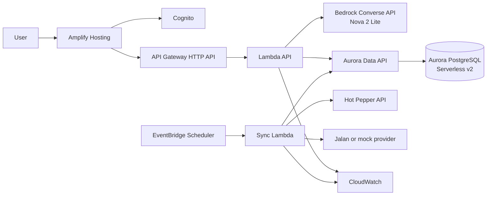

# AWS Architecture

## Scope and assumptions

- Internal prototype for approximately 10-30 users.
- Low and intermittent traffic.
- No production SLA, payment, or real booking integration in the first AWS release.
- Tokyo Region is the default.
- Search and price calculation must be deterministic and traceable.

## Target architecture



## Responsibilities

| Component | Responsibility |
|---|---|
| Amplify Hosting | Build and serve the frontend from GitHub with HTTPS and CDN |
| Cognito | Authenticate prototype members and issue JWTs |
| API Gateway HTTP API | Public API entry point and JWT authorization |
| Lambda API | Conversation orchestration, search, ranking, proposal creation, confirmation |
| Bedrock | Extract structured constraints and create natural-language explanations |
| Aurora PostgreSQL | Canonical facility, inventory, price, proposal, and reservation data |
| Data API | Let Lambda access Aurora without persistent connections or a NAT Gateway |
| Sync Lambda | Normalize source data and upsert it into canonical tables |
| EventBridge | Run optional scheduled source synchronization |
| CloudWatch | Logs, metrics, error alarms, and cost-relevant usage signals |

## Request flow

1. The frontend sends the user message and conversation ID to `POST /v1/chat`.
2. Lambda asks Bedrock to return a validated `TravelConstraints` JSON object.
3. Lambda validates dates, party size, budget, and required fields.
4. Lambda executes allow-listed parameterized SQL through the Data API.
5. Application code builds and ranks feasible hotel and restaurant combinations.
6. The selected records and price breakdown are persisted as a proposal.
7. Bedrock receives only the verified proposal and writes the explanation.
8. The frontend displays the answer and proposal details.
9. Confirmation calls `POST /v1/proposals/{id}/confirm` with an idempotency key.
10. A database transaction creates mock reservation records and decrements mock inventory.

## AI boundary

The LLM is used for:

- intent and constraint extraction;
- asking for missing information;
- explaining a verified proposal;
- generating user-friendly confirmation messages.

The LLM is not used for:

- arbitrary SQL generation;
- price arithmetic;
- inventory decisions;
- creating facility or reservation identifiers;
- changing reservation state directly.

## Initial Lambda shape

Use one deployable Lambda application with internal modules for the first prototype:

- `chat`
- `search`
- `proposal`
- `reservation`
- `providers`
- `persistence`

Split functions only when deployment size, permissions, ownership, or scaling requires it. This keeps the prototype inexpensive and easier to hand over.

## Cost controls

- Aurora Serverless v2: min 0 ACU, max 2 ACUs, auto-pause after 10 minutes.
- Aurora Standard storage; I/O-Optimized is unnecessary for prototype traffic.
- No VPC NAT Gateway; use Data API and AWS service endpoints.
- Bedrock on-demand inference only.
- CloudWatch log retention: 14 days in development.
- Amplify preview branches only when actively needed.
- AWS Budget alerts at a low monthly threshold before team access.

## Environments

Start with one `dev` stack. Add `prod` only after the prototype is accepted.

Resource names should follow:

```text
ring-crosscell-{environment}-{resource}
```

Examples:

```text
ring-crosscell-dev-api
ring-crosscell-dev-database
ring-crosscell-dev-user-pool
```

## Deliberately deferred

- Real payment.
- Real Jalan or Hot Pepper booking confirmation.
- Bedrock Agents and Knowledge Bases.
- Semantic/vector search.
- Multi-region deployment.
- Production-grade disaster recovery.
- Email delivery beyond a mock or sandboxed SES flow.
