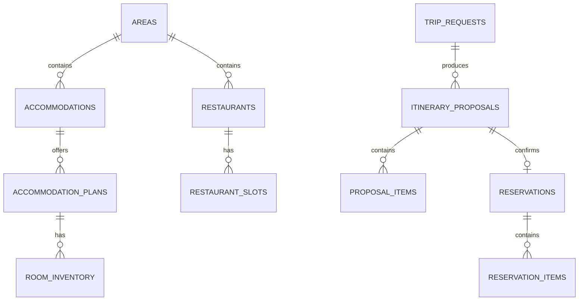

# Data Model

## Design goals

- Normalize Jalan and Hot Pepper records into a shared geographical model.
- Keep source IDs for traceability.
- Represent inventory separately from facility master data.
- Make every proposed price reproducible.
- Support idempotent reservation confirmation.

## Entity overview



## Core tables

### `areas`

Canonical location shared by both services.

| Column | Type | Notes |
|---|---|---|
| `id` | uuid | Primary key |
| `name` | text | Example: Hakone |
| `prefecture` | text | Example: Kanagawa |
| `latitude` | numeric | Canonical center point |
| `longitude` | numeric | Canonical center point |
| `created_at` | timestamptz | Audit field |

### `accommodations`

| Column | Type | Notes |
|---|---|---|
| `id` | uuid | Primary key |
| `source` | text | `jalan` or `mock_jalan` |
| `source_id` | text | External facility ID; unique with `source` |
| `area_id` | uuid | References `areas` |
| `name` | text | Facility name |
| `latitude` / `longitude` | numeric | Used for nearby restaurant ranking |
| `description` | text | Source description |
| `active` | boolean | Soft-disable flag |
| `source_updated_at` | timestamptz | Upstream timestamp when available |

### `accommodation_plans`

| Column | Type | Notes |
|---|---|---|
| `id` | uuid | Primary key |
| `accommodation_id` | uuid | Parent accommodation |
| `source_plan_id` | text | Upstream plan ID |
| `name` | text | Plan name |
| `includes_breakfast` | boolean | Search condition |
| `includes_dinner` | boolean | Search condition |
| `child_policy` | jsonb | Age bands and charges |
| `capacity_adults` | integer | Maximum adults |
| `capacity_children` | integer | Maximum children |

### `room_inventory`

One row per plan and stay date.

| Column | Type | Notes |
|---|---|---|
| `plan_id` | uuid | Part of primary key |
| `stay_date` | date | Part of primary key |
| `rooms_available` | integer | Never below zero |
| `adult_price` | integer | JPY including defined taxes |
| `child_price` | integer | JPY for the requested child band |
| `version` | integer | Optimistic-lock field |

### `restaurants`

| Column | Type | Notes |
|---|---|---|
| `id` | uuid | Primary key |
| `source` | text | `hotpepper` or mock |
| `source_id` | text | External shop ID; unique with `source` |
| `area_id` | uuid | References `areas` |
| `name` | text | Restaurant name |
| `genre` | text | Italian, Japanese, etc. |
| `latitude` / `longitude` | numeric | Distance calculation |
| `child_friendly` | boolean | Normalized prototype flag |
| `has_high_chair` | boolean | Normalized prototype flag |
| `active` | boolean | Soft-disable flag |

### `restaurant_slots`

| Column | Type | Notes |
|---|---|---|
| `restaurant_id` | uuid | Part of primary key |
| `slot_at` | timestamptz | Part of primary key |
| `seats_available` | integer | Mock or approved source value |
| `estimated_price_per_adult` | integer | JPY |
| `estimated_price_per_child` | integer | JPY |
| `version` | integer | Optimistic-lock field |

### Proposal and reservation tables

`trip_requests` stores validated constraints and the original message. `itinerary_proposals` stores total price, ranking score, expiry, and status. `proposal_items` stores immutable snapshots of each selected facility, source ID, date/time, unit price, and subtotal.

`reservations` stores the confirmation state and `idempotency_key`. `reservation_items` stores one result per hotel or restaurant booking provider. The initial provider state is `MOCK_CONFIRMED`.

## Required indexes and constraints

- Unique: `accommodations(source, source_id)`.
- Unique: `restaurants(source, source_id)`.
- Index: `room_inventory(stay_date, rooms_available)`.
- Index: `restaurant_slots(slot_at, seats_available)`.
- Index: accommodations and restaurants by `area_id` and `active`.
- Unique: `reservations(idempotency_key)`.
- Check constraints prevent negative prices, rooms, and seats.
- Foreign keys use restrictive deletion for transactional records.

## Cross-service search

Search should use application-owned SQL with this logical order:

1. Select available plans for the date and party size.
2. Calculate the exact accommodation subtotal using adult and child rules.
3. Select available restaurant slots in the same area and requested meal window.
4. Rank restaurants by child suitability and distance from the selected accommodation.
5. Build combinations whose total is within budget.
6. Rank combinations deterministically.
7. Persist the winning proposal and immutable price snapshots.

The initial ranking formula can be explicit and testable:

```text
score = budget_fit * 0.40
      + child_suitability * 0.25
      + distance_score * 0.20
      + meal_convenience * 0.15
```

## Reservation transaction

Confirmation must run in one database transaction:

1. Reject an expired or already-cancelled proposal.
2. Return the existing reservation for a repeated idempotency key.
3. Lock the selected inventory rows.
4. Verify rooms and seats again.
5. Decrement mock inventory.
6. Insert reservation and reservation items.
7. Commit and return generated mock reservation references.
